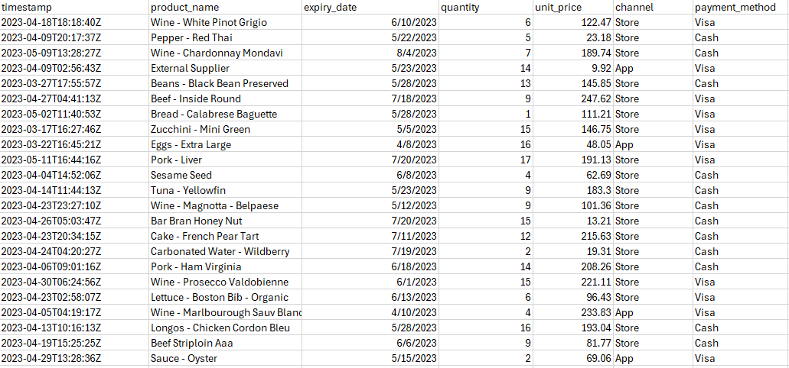
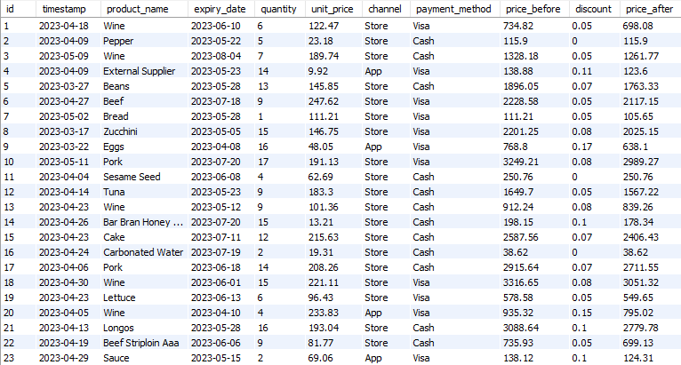
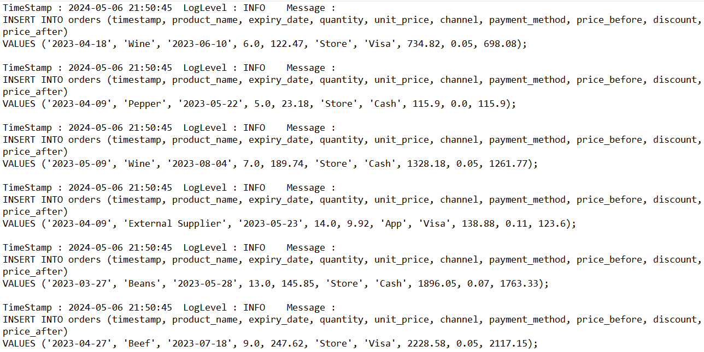

# Functional Programming With Scala

This Scala project implements a rule engine for a retail store that qualifies orders' transactions for discounts based on a set of qualifying rules. The project aims to automate the calculation of discounts based on various criteria such as product expiration date, product category, transaction date, quantity, and payment method. The core logic of the project is implemented in a pure functional manner, adhering to functional programming principles.

## Purpose

The aim of this project is to automate the processing of sales orders and calculate discounts to help businesses analyze their sales data more efficiently. By automating these processes, businesses can save time and reduce errors that may occur in manual calculations.

## Process

1.  **Data Ingestion**: The project reads sales order data from a CSV file (`TRX1000.csv`).
2.  **Data Processing**: Each line of the input file is processed to create an `Order` object, which is then used to calculate discounts based on various criteria.
3.  **Discount Calculation**:
    -   **March 23rd Discount**: Orders placed on March 23rd receive a special discount.
    -   **Quantity Discount**: Discounts are applied based on the quantity of products purchased.
    -   **Category Discount**: Discounts are applied based on the product category.
    -   **Expiration Date Discount**: Products with an expiration date less than 30 days from the transaction date receive a discount.
    -   **App Discount**: Orders made through the app receive a special discount.
    -   **Visa Discount**: Orders paid with a Visa card receive a discount.
4.  **Database Insertion**: The processed data, including the calculated discounts, is inserted into a MySQL database (`Orders`).

### Implementation Details

The core logic of the project is implemented using pure functional programming concepts in Scala. The project reads data from a `CSV` file, processes each order, calculates the applicable discounts based on the qualifying rules, and inserts the processed data into a `MySQL` database.

### How To Use

    
1.  Install dependencies ( Scala, `log4j-1.2-api-2.23.1.jar` , `log4j-core-2.23.1.jar`, `mysql-connector-java-8.0.11.jar` ).
    
2.  Configure the `log4j2.xml` file in the `src/main/Resources` directory if needed.
    
3.  Prepare your data file (`TRX1000.csv`) with the required columns.  
   
4.  Run the project using IDE or Command Line.    
       
5.  View the logs in the `src/main/logs` directory for processing details.

## Row Data

## Output 

## Logs

